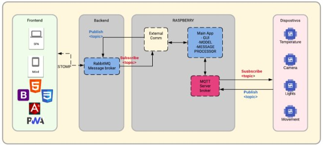
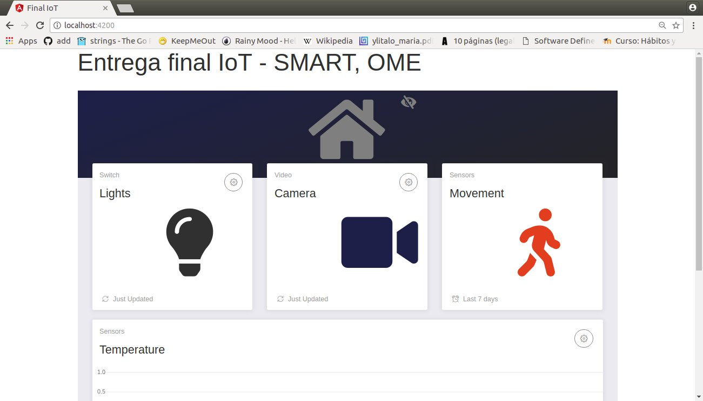
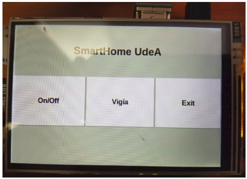
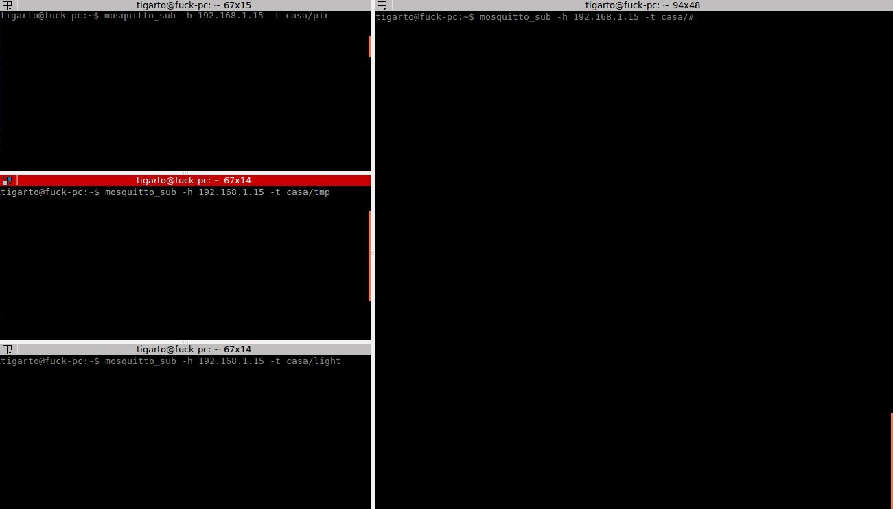
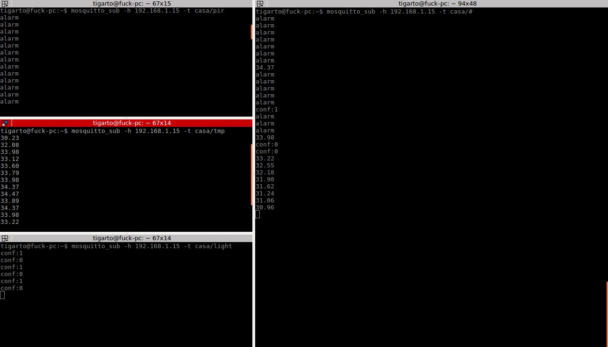

# IoT
Repositorio donde se almacenarán los proyectos de prueba del curso de IoT.


UdeA

# Arquitectura de la aplicación #



# Pasos (aún estan incompletos) #

**Aun falta**:
1. Poner a funcionar y y documentar la parte asociada al servidor de streaming.
2. Poner a funcionar y documentar la integración de la parte web.

Esto se hizo en el front end

```bash
npm install
npm run build
npm run start
```

Este fue el resultado:




1. Verificar el funcionamiento de la interfaz web.

Falta

**Lo que hay**

1. **Correr la aplicación de control en la rPI**:

Acceder a la carpeta donde esta se encuentra:

```bash
cd gateway-rasp
```

Ejecutar el script principal:

```bash
python3 main.py
```

Si todo esta bien aparecerá la interfaz:



**Opcional**: Para hacer debug se recomienda hacer un seguimiento a los mensajes que se envian por medio del protocolo MQTT configuranto el mosquito cli de acuerdo a los topics creados para la comunicación entre los clientes. La siguiente ventana ilustra esto:



De la figura anterior, notese que aun no hay clientes que publiquen de modo que no se vera nada.

2. **Programar y correr las aplicaciones en los NodeMCU**

Tal y como se muestra en el siguiente [enlace](./things-arduino/README.md). Lleve a cabo la conexión del los NodeMCU y los sensores involucrados en la aplicación (para facilitar las cosas se cuentan con base shield para los NodeMCU). Luego programe los NodeMCU.

Si todo sale bien, ya sera posible la transmision de información entre los clientes de modo que la interfaz grafica ya podrá recibir información y enviar comandos sobre el hardware para que realize las acciones requeridas de acuerdo a la lógica de control (Prender y apagsr leds, entrar en modo vigia, etc).

Tambien, si se esta haciendo debug, ya se podra visualizar los mensajes que se intercambian entre los clientes tal y como se muestra en la siguiente figura:




## TODOs ##
1. Agregar un control de una puerta.
2. ...
