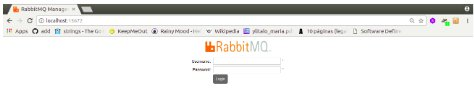
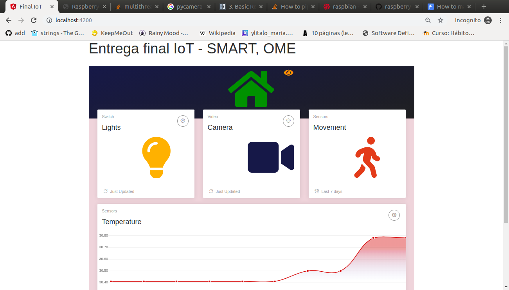
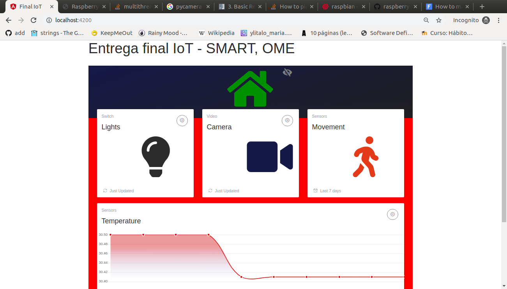
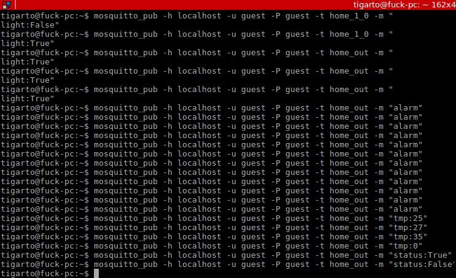

# IoT
Repositorio donde se almacenarán los proyectos de prueba del curso de IoT.


UdeA

# Arquitectura de la aplicación #


# Pasos (Aun estan incompletos) #

**Aun falta**:
1. Poner a funcionar y y documentar la parte asociada al servidor de streaming.
2. Poner a funcionar y documentar la integración de la parte web.

Esto se hizo en el front end

```bash
npm install
npm run build
npm run start
```


**Lo que hay**

1. **Correr la aplicación de control en la rPI**:

Acceder a la carpeta donde esta se encuentra:

```bash
cd gateway-rasp
```

Ejecutar el script principal:

```bash
python3 main.py
```

Si todo esta bien aparecerá la interfaz:


**Opcional**: Para hacer debug se recomienda hacer un seguimiento a los mensajes que se envian por medio del protocolo MQTT configuranto el mosquito cli de acuerdo a los topics creados para la comunicación entre los clientes. La siguiente ventana ilustra esto:


De la figura anterior, notese que aun no hay clientes que publiquen de modo que no se vera nada.

2. **Programar y correr las aplicaciones en los NodeMCU**

Tal y como se muestra en el siguiente [enlace](./things-arduino/README.md). Lleve a cabo la conexión del los NodeMCU y los sensores involucrados en la aplicación (para facilitar las cosas se cuentan con base shield para los NodeMCU). Luego programe los NodeMCU.

Si todo sale bien, ya sera posible la transmision de información entre los clientes de modo que la interfaz grafica ya podrá recibir información y enviar comandos sobre el hardware para que realize las acciones requeridas de acuerdo a la lógica de control (Prender y apagsr leds, entrar en modo vigia, etc).

Tambien, si se esta haciendo debug, ya se podra visualizar los mensajes que se intercambian entre los clientes tal y como se muestra en la siguiente figura:


3. **Ejecutar la interfaz web**
   
Antes de crear la interfaz web es necesario llevar a cabo los siguientes pasos:

**Arrancar el servidor RabbitMQ**

Como la interfaz web va a interactuar con el servidor RabbitMQ es necesario ejecutarlo tal y como se muestran en los siguientes comandos:

```bash
sudo service rabbitmq-server start
sudo rabbitmq-plugins enable rabbitmq_mqtt
sudo rabbitmq-plugins enable rabbitmq_web_stomp
sudo rabbitmq-plugins enable rabbitmq_management
sudo rabbitmq-plugins list
```

Si todo esta bien, ya se tendra el RabbitMQ funcionando. Para verificar esto, puede ingresar en el browser la URL **http://localhost:15672** siendo la salida para el caso la mostrada a continuación:



Aunque de momento no se va a usar mas, con la anterior figura se puede evidenciar que el broker RabbitMQ ya esta en funcionamiento.

El usuario y el password por default para acceder a la dashboard de la interfaz de control del RabbitMQ es **guest** y **guest** respectivamente.

**Arrancar la interfaz web**

Dentro del directorio **frontend-stomp** se encuentra todo el código encargado de implementar la interfaz web. Como primer paso, es necesario ingresar a este directorio:

```bash
cd frontend-stomp
```

Una vez allí, se arranca la interfaz web ejecutando los siguientes comandos:

```bash
npm install
npm start
```

Este fue el resultado:


**Verificar el funcionamiento de la interfaz web**

Inicialmente, se puede emplear el **mosquitto_pub** para publicar mensajes que interactuen con la interfaz web. Asumiento que la aplicación web y el mosquitto_pub se encuentran en la misma maquina y empleando el usuario y el password por defecto (guest y guest) del RabbitMQ, se emplearon los siguiente comandos para llevar a cabo la prueba:

* **Prender y apagar la luz**:

```bash
# Prendiento la luz
mosquitto_pub -h localhost -u guest -P guest -t home_out -m "light:True"
```

El resultado de este comando en la interfaz web sería:


```bash
# Apagando la luz
mosquitto_pub -h localhost -u guest -P guest -t home_out -m "light:False"
```

El resultado de este comando en la interfaz web sería:


* **Graficar temperatura**:

Para llevar a cabo esta prueba se el mosquitto_pub para enviar mensajes asociados a la temperatura siguiendo la siguiente forma:

```bash
# Temperatura
mosquitto_pub -h localhost -u guest -P guest -t home_out -m "tmp:VALOR_TEMPERATURA"
```

A continuación se muestran varias temperaturas simuladas:

```bash
mosquitto_pub -h localhost -u guest -P guest -t home_out -m "tmp:25"
mosquitto_pub -h localhost -u guest -P guest -t home_out -m "tmp:27"
mosquitto_pub -h localhost -u guest -P guest -t home_out -m "tmp:35"
mosquitto_pub -h localhost -u guest -P guest -t home_out -m "tmp:0"
```

Cada vez que se envia un valor de temperatura, la parte de la interfaz grafica asociada a la temperatura se actualiza tal y como muestra a continuación (para algunos valores, no necesariamente los anteriormente ensayados):



* **Parte del sensor de movimiento**
La aplicación esta diseñada para detectar movimiento y avisar cuando este pase. Para probar que este se encuentre bien, se enviaron los siguientes mensajes empleando el mosquito_pub:

```bash
# Sensor de moviminento activado
mosquitto_pub -h localhost -u guest -P guest -t home_out -m "status:True"
```

Cuando esto se da, la interfaz hace una indicación de esto colocando su fondo en rojo tal y como se muestra a continuación:



Cuando no haya presencia, el mensaje empleado para simular esto es el siguiente:

```bash
# Sensor de moviminento activado
mosquitto_pub -h localhost -u guest -P guest -t home_out -m "status:False"
```

Y la salida en la interfaz es:


La siguiente figura muestra todos los comandos de test empleados para verificar el correcto funciomiento basico de la interfaz web:



**Parte del streaming**
Esta parte depende de la cámara de la rPi, de modo que como aun no se ha integrado el funcionamiento de este componente a la interfaz no se puede aun realizar la prueba. 

## TODOs ##
1. Documentar la parte en la cual se integran los diferentes elementos.
