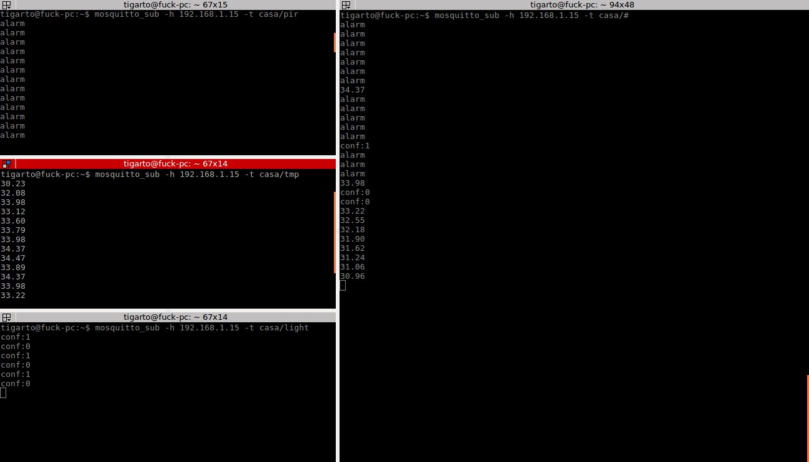

# Raspberry #

## Prerequisitos ##

### Instalación del broker ###

```bash
sudo apt-add-repository ppa:mosquitto-dev/mosquitto-ppa
sudo apt-get update
sudo apt-get install mosquitto
sudo apt-get install mosquitto-clients
```

### Instalación del paho ###

#### Python ####

```bash
sudo pip install paho-mqtt
```

#### Python 3 ####

```bash
sudo pip3 install paho-mqtt
```

Si los prerequisitos se cumplen puede ir directamente a la instalación de la aplicación.

## Ejecución de la aplicación ##

#### Comando python ####

```bash
python3 main.py
```

#### Salida ####


## Pruebas funcionales ##

Para probar la aplicación se puede hacer uso de los comandos de mosquitto o de algún otro cliente mqtt, ya sea local o 
remoto. La siguiente pantalla muestra una prueba que se llevó a cabo para verificar que la conexión entre los arduinos 
y la rPi se estaba dando.




## Ejecución de la aplicación en desarrollo ##
- Docker con rabbitMQ (servidor remoto)
- Docker con Mosquitto (local)
- docker-compose.yml

   archivo -dev: valores de las variables para desarrollo

## Mensajes Rpi -> Device ##
### Desde la raspberry ###
Abrimos una terminal y nos subscribimos al tópico del dispositivo que queremos monitorear/simular:
- mosquitto_sub - h {host} -t {topic: device_type/device_id}
- Por ejemplo, si queremos monitorear los mensajes enviados desde la Rpi a el dispositivo tipo *Light* con identificador *0*: 
   ```bash
   mosquitto_sub -h localhost -t Light/0 -d 
   ```

### Light ###
- Mensajes que puede enviar la Rpi a un dispositivo tipo *Light*
   - "0" : OFF
   - "1" : ON
   - "2" : Toggle light


## Mensajes Device -> Rpi ##
### Para simular un dispositivo (Arduino) ###
Para simular un mensaje desde un dipositivo a la Rpi, abrimos una terminal y publicamos mensajes al tópico de escucha de la Rpi:
- mosquito_pub -h { *dir. IP Rpi* } - t {topic} -m {message: id, payload}
- Ejemplo (en ambiente de desarrollo):
   ```bash
   mosquitto_pub -h localhost -t home -m 0,100
   ```

Formato mensaje CSV: \<*id*\>,\<*payload*\>

### Para todos los Devices ###

Tipo de \<*payload*\>:

|**Código**| **Significado** |
|:----:|:-----------:|
|"100" | ONLINE_STATE|
|"-100"| OFFLINE_STATE|
|"-1"  | UNKNOWN|

### Light ###
Tipo de \<*payload*\>:

|**Código**| **Significado** |
|:----:|:-----------:|
|"0" | OFF|
|"1" | ON |


## Ejecución de la aplicación en producción ##
- Archivo prod.env: valores de las variables para producción
- Instalar mosquitto en rasberry 
- Compilar y subir a la raspberry