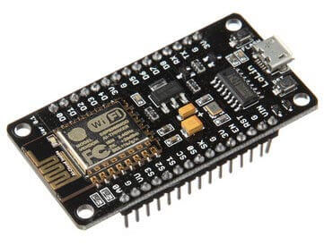
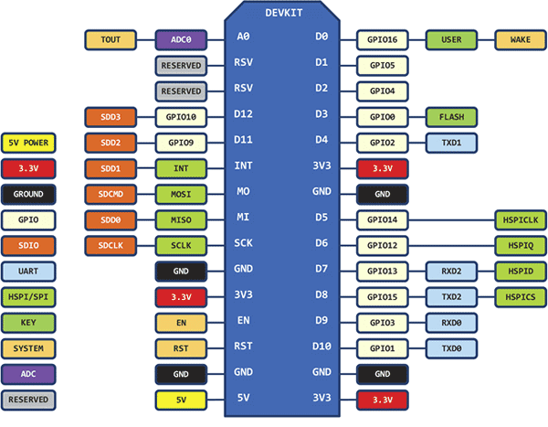
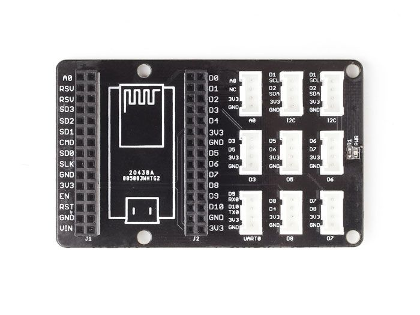
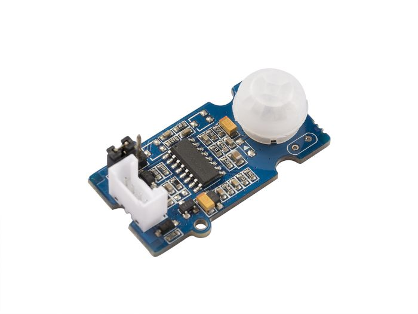
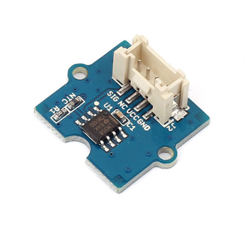
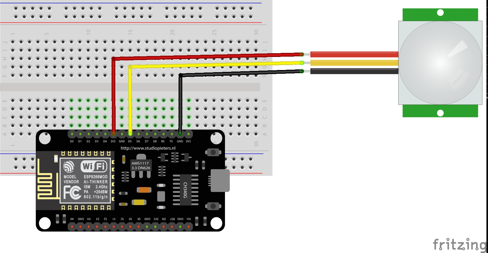
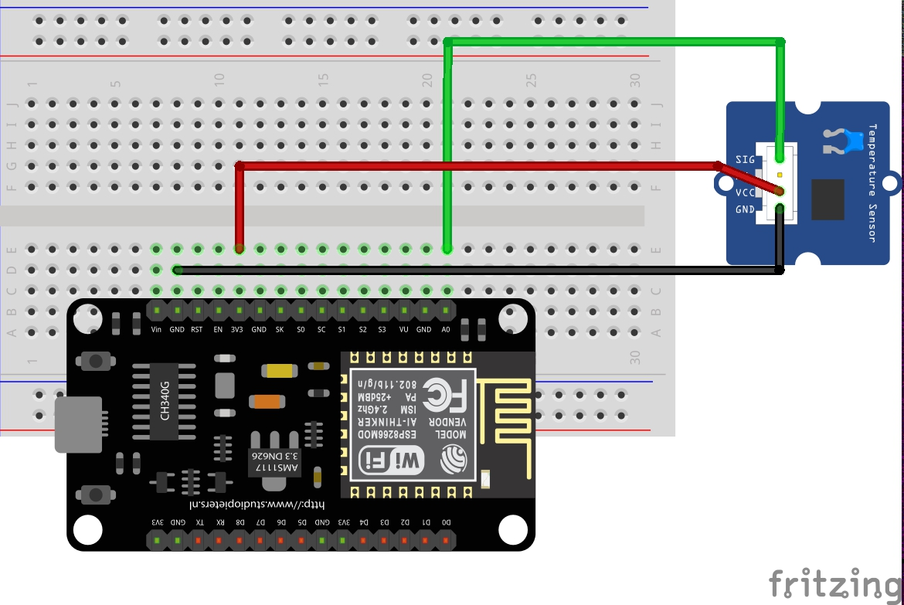

# SmartHome #

## Descripción ##
En esta sección se describen aquellos aspectos relacionados del proyecto relacionado con el hardware.

## Plataformas de hardware empleadas ##

1. **NodeMCU** ([información](https://en.wikipedia.org/wiki/NodeMCU))



La distribución de pines del nodeMCU se muestra a continuación:



2. **Placa Node MCU** ([información](http://wiki.seeedstudio.com/Grove_Base_Shield_for_NodeMCU_V1.0/))



3. **Grove - PIR Motion Sensor** ([Información](http://wiki.seeedstudio.com/Grove-PIR_Motion_Sensor/))



4. **Grove - Temperature Sensor V1.2** ([Información](http://wiki.seeedstudio.com/Grove-Temperature_Sensor_V1.2/))



Los elementos 3 y 4 vienen en el Grove - [Starter Kit V2.0](https://seeeddoc.github.io/Grove-Starter_Kit_V2.0/) disponible en el laboratorio.


## Software ##

### Aplicaciones en el NodeMCU ###

#### PIR MQTT ####

**Componentes**:
1. NodeMCU
2. Sensor PIR

**Montaje**:



**Codigo**: [PIR_MQTT.ino](./PIR_MQTT/PIR_MQTT.ino)

**Nota**: Antes de programar el nodeMCU no olvidar editar los campos relacionados con la red inalambrica (ssid) su password (password) y la IP donde se encuentra el broker en ejecución (mqtt_server). Ver el fragmendo de código a continuacion.

```C++
//SENSOR MOVIMIENTO
...
// Update these with values suitable for your network.
const char* ssid = "SSID_NAME";  // Cambiar
const char* password ="SSID_PASS"; // Cambiar
const char* mqtt_server = "IP_MQTT_SERVER"; // Cambiar
```

#### Temperature MQTT ####

**Componentes**:
1. NodeMCU
2. Sensor de temperatura

**Montaje**:



**Codigo**: [Temperature_MQTT.ino](./Temperature_MQTT/Temperature_MQTT.ino)


**Nota**: Antes de programar el nodeMCU no olvidar editar los campos relacionados con la red inalambrica (ssid) su password (password) y la IP donde se encuentra el broker en ejecución (mqtt_server). Ver el fragmendo de código a continuacion.


```C
//SENSOR MOVIMIENTO
...
// Update these with values suitable for your network.
const char* ssid = "SSID_NAME";  // Cambiar
const char* password ="SSID_PASS"; // Cambiar
const char* mqtt_server = "IP_MQTT_SERVER"; // Cambiar
```

## Prueba de funcionamiento ##

Usando los clientes del mosquito verifique que hay comuniciación entre los diferentes elementos involucrados.

## Enlaces de utilidad ##
1. http://wiki.seeedstudio.com/Sidekick_Basic_Kit_for_Arduino_V2/

<!---
https://github.com/roppert/mosquitto-python-example
https://jpmens.net/2013/02/25/lots-of-messages-mqtt-pub-sub-and-the-mosquitto-broker/
https://github.com/FarmBot-Labs/FarmBot-Python-Examples
https://github.com/rb28z2/python-mqtt-nvr
https://github.com/larsx2/mqtt-examples/blob/master/pubsub-client.py

https://github.com/octopusengine/octopusLAB_mqtt

https://github.com/EDULISES/mqttPython/tree/master/Python

https://github.com/stoefln/MqttToPd

https://github.com/wedoiot/mqttGPIO/blob/master/MQTTPythonClient.py

https://elementztechblog.wordpress.com/2016/07/18/arduino-mqtt-library-for-sim800-gsm-modem/

https://github.com/richardFirth/PythonMQTT

https://github.com/caghankoksal/mqttExample **

https://github.com/cnsval/MQTT_RaspberryPi_GPIO/blob/master/MQTT_Test.py ****

https://github.com/ashiqks/MQTT-with-Python ******

https://github.com/iotJumpway/RPI-Examples **********

https://github.com/wirepas/backend-client

https://github.com/agnsal/speechMqtt ******************************

https://github.com/rangertaha/messaging-patterns ----- (muy bueno)

-->